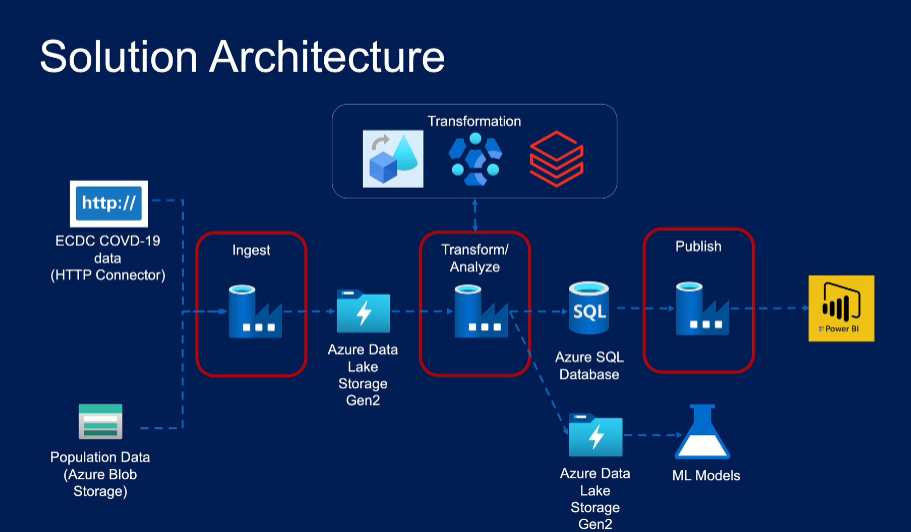
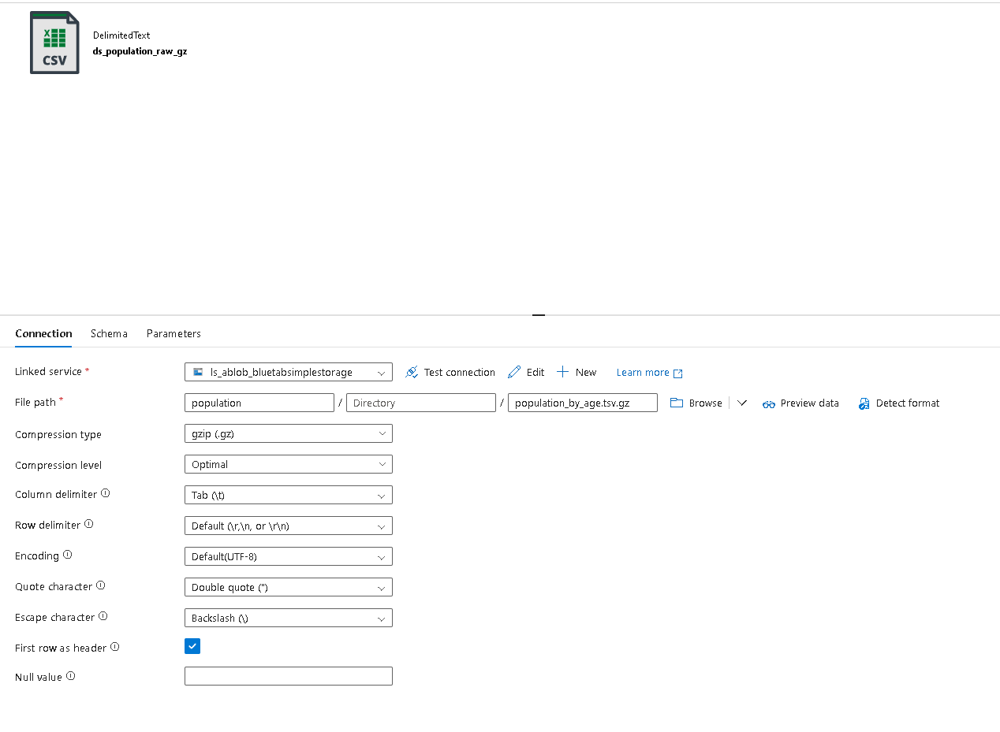
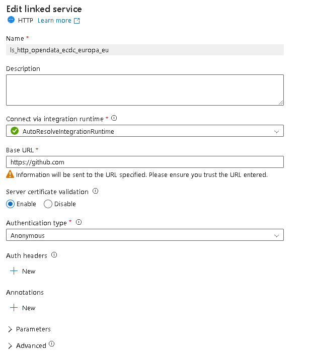
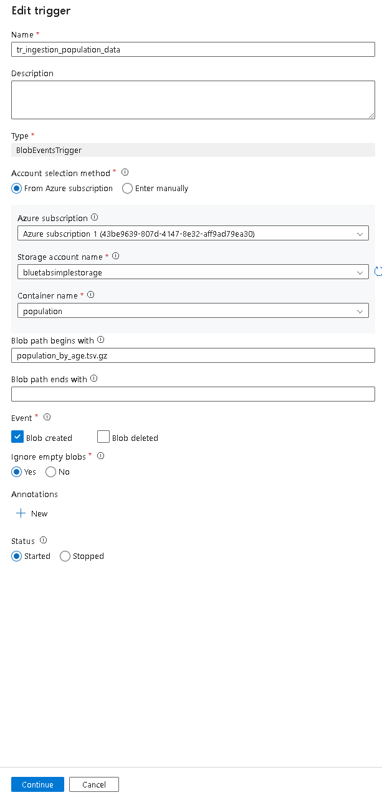
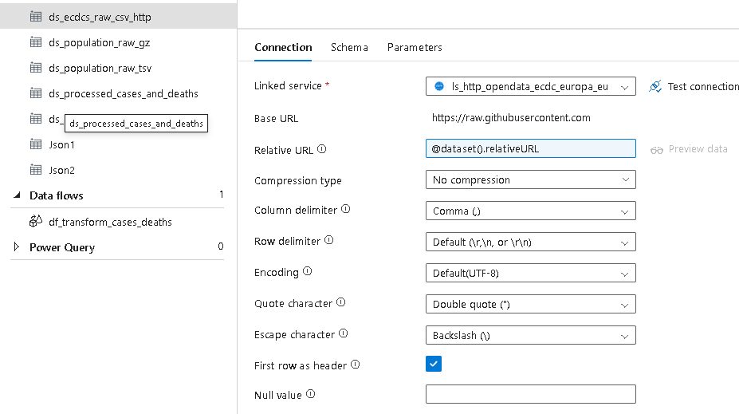
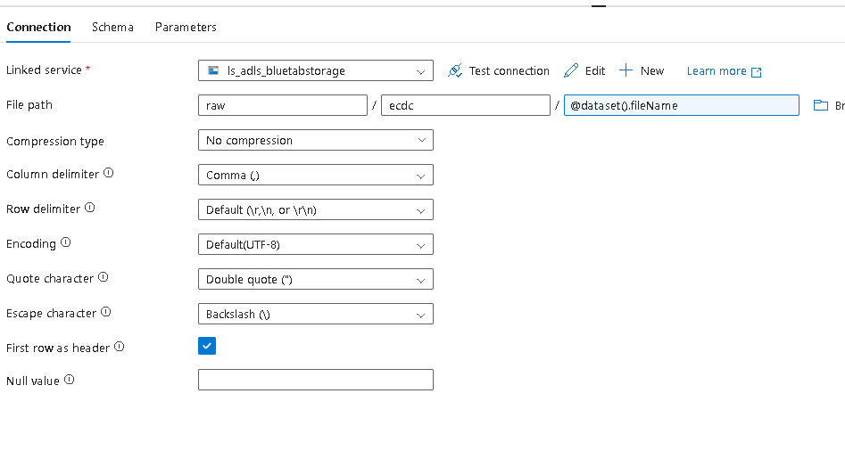
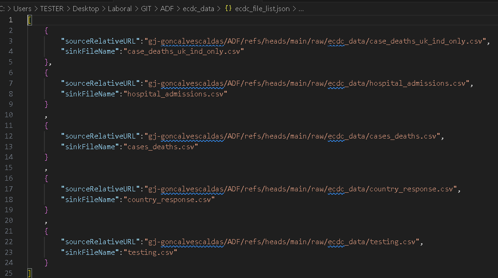
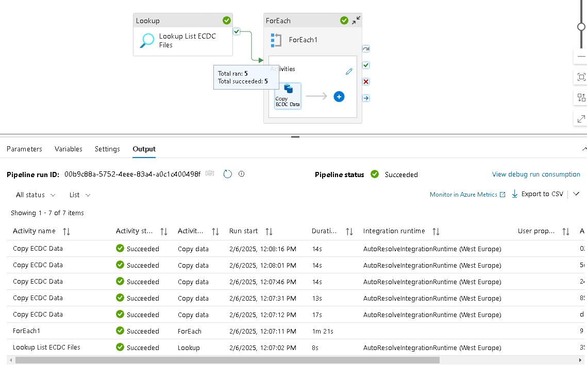
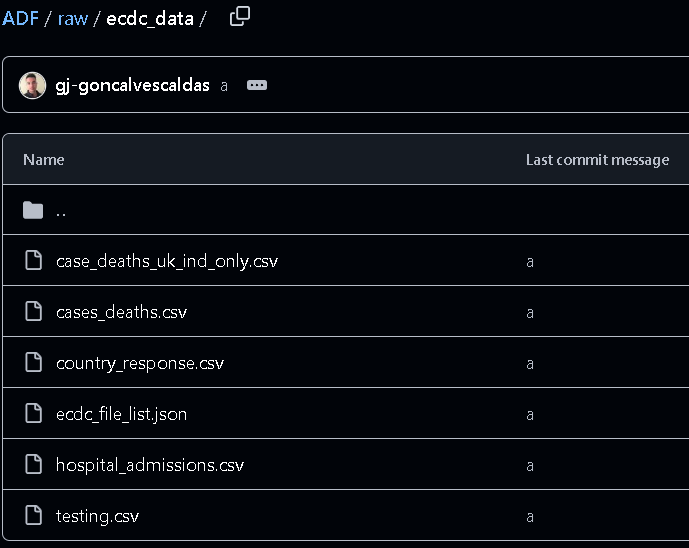
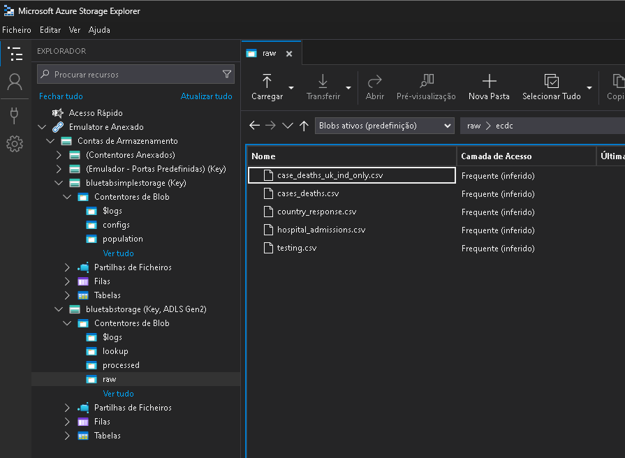

## Data Factory Course

### Data Ingestion from Azure Blob

1. **Created a Linked Service**  
   

2. **Created a Dataset in Databricks**  
   Referenced the compressed data in a `.gz` file. The relative URL is on my GitHub account.  
   

3. **Created a Second Linked Service to ADLS Gen2**  
   Created an empty sink dataset for the pipeline with the desired destination.  
     
   

4. **Built the Pipeline**  
   - Used a **Lookup Activity** to check if the first file exists.  
   - Retrieved metadata (column count, size, and existence).  
   - Added an **If Condition** to verify if the file columns matched the manually specified columns.  
     - If no, used a **Fail Activity** to return an error.  
     - If yes, used a **Copy Data Activity** to uncompress the data from `bluetabsimplestorage/population/population_by_age` to `bluetabstorage/raw/population/population_by_age` (ADLS Gen2).  
   - Deleted the file from the blob storage after ingestion.  
   

5. **Created a Trigger**  
   Associated the trigger with the pipeline. The trigger is always active and runs the pipeline when `population_by_age.tsv.gz` is uploaded to `bluetabsimplestorage/population/`.  
   

---

### Data Ingestion from HTTP

1. **Created a Linked Service for HTTP**  
   Used the base URL `raw.githubusercontent.com`.  
   

2. **Created a Source Dataset**  
   Added a parameter for the relative URL to handle various datasets. The relative URL is on my GitHub account.  
     
   

3. **Created a Sink Dataset**  
   Added a parameter for the file name to handle various datasets.  

4. **Uploaded a JSON File to Blob Storage**  
   The JSON file contained the relative URLs and file names for the datasets.  
   

5. **Constructed the Pipeline**  
   - Used a **Lookup Activity** to check the JSON file and retrieve the list of files.  
   - Used a **ForEach Activity** to iterate through the list and execute a **Copy Data Activity** for each element.  
     - The source dataset pointed to my GitHub account.  
     - The sink dataset pointed to my ADLS Gen2.  
   - This copied all files listed in the JSON from my GitHub account to my ADLS Gen2.  
     
     
   
