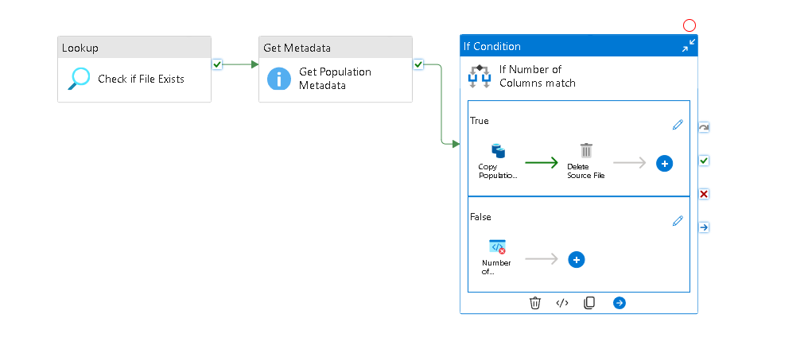

## Data Factory Course

ECDC COVID-19 data (cases, deaths, country responses, and hospital admissions)

### Data Ingestion from Azure Blob

1. **Created a Linked Service**  
   

2. **Created a Dataset in Databricks**  
   Referenced the compressed data in a `.gz` file. 
   

3. **Created a Second Linked Service to ADLS Gen2**  
   Created an empty sink dataset for the pipeline with the desired destination.  

4. **Built the Pipeline**  
   - Used a **Lookup Activity** to check if the first file exists.  
   - Retrieved metadata (column count, size, and existence).  
   - Added an **If Condition** to verify if the file columns matched the manually specified columns.  
     - If no, used a **Fail Activity** to return an error.  
     - If yes, used a **Copy Data Activity** to uncompress the data from `bluetabsimplestorage/population/population_by_age` to `bluetabstorage/raw/population/population_by_age` (ADLS Gen2).  
   - Deleted the file from the blob storage after ingestion.  
   

5. **Created a Trigger**  
   Associated the trigger with the pipeline. The trigger is always active and runs the pipeline when `population_by_age.tsv.gz` is uploaded to `bluetabsimplestorage/population/`.  
   

---

### Data Ingestion from HTTP

1. **Created a Linked Service for HTTP**  
   Used the base URL `raw.githubusercontent.com`.  
   

2. **Created a Source Dataset**  
   Added a parameter for the relative URL to handle various datasets. The relative URL is on my GitHub account.  
     

3. **Created a Sink Dataset**  
   Added a parameter for the file name to handle various datasets.  
   
   
4. **Uploaded a JSON File to Blob Storage**  
   The JSON file contained the relative URLs and file names for the datasets.  
   

5. **Constructed the Pipeline**  
   - Used a **Lookup Activity** to check the JSON file and retrieve the list of files.  
   - Used a **ForEach Activity** to iterate through the list and execute a **Copy Data Activity** for each element.  
     - The source dataset pointed to my GitHub account.  
     - The sink dataset pointed to my ADLS Gen2.  
   - This copied all files listed in the JSON from my GitHub account to my ADLS Gen2.  
     
     
   

   ## Data Flows

### Cases and Deaths Transformation
In this section, I performed transformations on cases_and_deaths.

#### Setup
- Created a **source dataset** (`cases_and_deaths`) and a **sink dataset** for the transformed data.  
- Included a **country_lookup dataset** to handle country codes (2-digit and 3-digit formats).  
- Used a smaller sample dataset (`case_deaths_uk_ind_only`) with approximately 2000 records for debugging and previewing transformations.  
  

#### Data Flow Transformations
1. **Preview of the Dataset**  
   

2. **Filter**  
   Filtered the `cases_and_deaths` dataset to include only European countries (e.g., removed India).  

3. **Select and Rename**  
   Dropped 2 columns and renamed the `date` column.  

4. **Pivot**  
   Pivoted the `indicator` column (which has values `confirmed_cases` and `deaths`) to create two new columns: `confirmed_cases_count` and `deaths_count`.  

5. **Lookup**  
   Joined the dataset with the `country_lookup` dataset to include both 2-digit and 3-digit country codes. The LookUp activity works like a Join so after I need to remove duplicate columns and reorganized the data with a Select.  

6. **Sink**  
   Published the transformed dataframe to the desired location using the sink dataset.  

#### Execution
- The debug mode in Data Flows provides a preview of the transformations but does not execute the data flow, so I created a pipeline to execute the data flow.  
  
  
  
### Hospital Admissions Data Transformation

#### Original File Structure
The original file contains the following columns:
- **country**: Name of the country.
- **indicator**: Type of indicator (e.g., hospital occupancy, ICU occupancy).
- **date**: Date of the report.
- **year_week**: Year and week of the report (e.g., 2023-W10).
- **value**: Numerical value of the indicator.
- **source**: Source of the data.
- **url**: URL reference for the data.

---

#### Target Daily File Structure
The target daily file includes the following columns:
- **country**: Name of the country.
- **country_code_2_digit**: 2-digit country code.
- **country_code_3_digit**: 3-digit country code.
- **Population**: Population of the country.
- **reported_date**: Date of the report.
- **hospital_occupancy_count**: Number of hospital occupancies reported.
- **icu_occupancy_count**: Number of ICU occupancies reported.
- **source**: Source of the data.

#### Target Weekly File Structure
The target weekly file includes the following columns:
- **country**: Name of the country.
- **country_code_2_digit**: 2-digit country code.
- **country_code_3_digit**: 3-digit country code.
- **Population**: Population of the country.
- **reported_year_week**: Year and week of the report (e.g., 2023-W10).
- **reported_week_start_date**: Start date of the reported week.
- **reported_week_end_date**: End date of the reported week.
- **new_hospital_occupancy_count**: New hospital occupancies reported for the week.
- **new_icu_occupancy_count**: New ICU occupancies reported for the week.
- **source**: Source of the data.

---

#### Transformation Process
To accomplish the desired structure, I used the following transformations:  
**Select**, **LookUp**, **Conditional Split**, **Join**, **Pivot**, **Sort**, **DerivedColumn**, and **Aggregate**.

  
  

## Databricks Activity  

### **Set-up**  
For this transformation, I utilized an existing Databricks Service within a Cluster that I had previously set up for another project. Since the data is stored in Delta Lake, I needed to grant Databricks access by creating a **Scope** for my service Key Vaults. These Vaults contain the secrets for my **bluetab-app** service principal, which has the necessary permissions to access the Delta Lake.  

As shown in the images below, I configured the scope and ensured secure access to the storage. 

Next, I needed to **mount** access to my storage containers. Instead of creating a new script, I reused an existing piece of code from a previous project stored in my **Databricks folder** on GitHub. This allowed me to efficiently set up the necessary connections without duplicating effort.

 
 

I did a transformation notebook in Databricks mostly in PySpark, which is available in my Databricks folder on this repository. The main objective is to run this notebook on DataFactory, so I created a linked service to my Databricks space and ran a pipeline for that notebook.  

**Data Source and Data Sink Below**  

## Copy Data to Azure SQL  

First, in my **bluetab-database**, I created the tables `cases_and_deaths` and `hospital_admissions_daily`. After that, I linked the new tables to the **Datasets** feature in Azure Data Factory (ADF) and copied my transformed dataframes to the database.  

## Parent Pipeline  

In this section, I created a **Parent Pipeline** that orchestrates the entire workflow. This pipeline includes:  
- **2 Ingestion Pipelines** (for raw data ingestion)  
- **3 Processed Pipelines** (for data transformation and processing)  
- **1 Sqlize Pipeline** (for copying processed data to Azure SQL)  

The parent pipeline ensures that all tasks are executed in the correct order, maintaining dependency between the pipelines. Below is a visual representation of the parent pipeline, showcasing all the pipelines and datasets involved in the project. 

### Alternative Approach: Trigger Dependency  
Instead of using a parent pipeline with explicit dependencies, I could have implemented **Trigger Dependency**. This approach would involve setting up triggers for each pipeline, ensuring that downstream pipelines only execute after their upstream dependencies are successfully completed. While this method can also achieve the desired workflow, I opted for the parent pipeline approach for better visibility and centralized control.  
