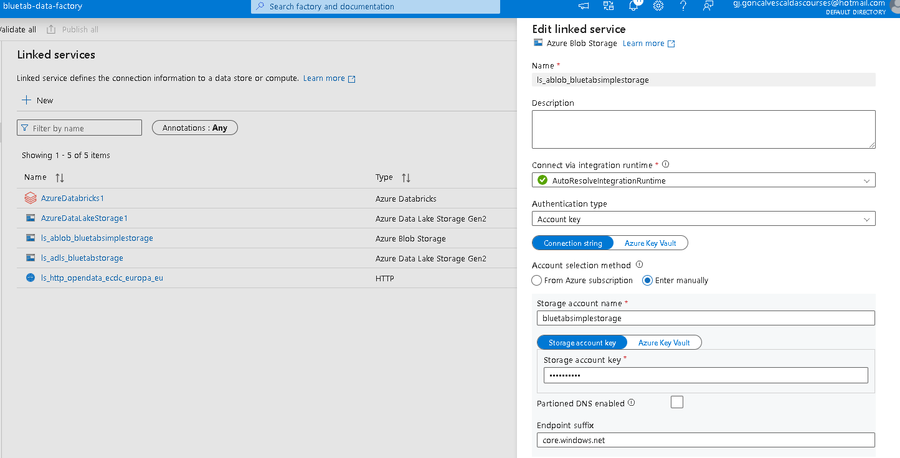
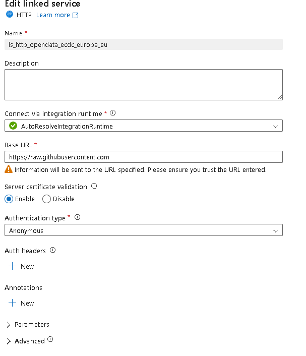

## Data Factory Course

ECDC COVID-19 data (cases, deaths, country responses, and hospital admissions)

### Data Ingestion from Azure Blob

1. **Created a Linked Service**  
   

2. **Created a Dataset in Databricks**  
   Referenced the compressed data in a `.gz` file. 
   

3. **Created a Second Linked Service to ADLS Gen2**  
   Created an empty sink dataset for the pipeline with the desired destination.  

4. **Built the Pipeline**  
   - Used a **Lookup Activity** to check if the first file exists.  
   - Retrieved metadata (column count, size, and existence).  
   - Added an **If Condition** to verify if the file columns matched the manually specified columns.  
     - If no, used a **Fail Activity** to return an error.  
     - If yes, used a **Copy Data Activity** to uncompress the data from `bluetabsimplestorage/population/population_by_age` to `bluetabstorage/raw/population/population_by_age` (ADLS Gen2).  
   - Deleted the file from the blob storage after ingestion.  
   

5. **Created a Trigger**  
   Associated the trigger with the pipeline. The trigger is always active and runs the pipeline when `population_by_age.tsv.gz` is uploaded to `bluetabsimplestorage/population/`.  
   

---

### Data Ingestion from HTTP

1. **Created a Linked Service for HTTP**  
   Used the base URL `raw.githubusercontent.com`.  
   

2. **Created a Source Dataset**  
   Added a parameter for the relative URL to handle various datasets. The relative URL is on my GitHub account.  
     

3. **Created a Sink Dataset**  
   Added a parameter for the file name to handle various datasets.  
   
   
4. **Uploaded a JSON File to Blob Storage**  
   The JSON file contained the relative URLs and file names for the datasets.  
   

5. **Constructed the Pipeline**  
   - Used a **Lookup Activity** to check the JSON file and retrieve the list of files.  
   - Used a **ForEach Activity** to iterate through the list and execute a **Copy Data Activity** for each element.  
     - The source dataset pointed to my GitHub account.  
     - The sink dataset pointed to my ADLS Gen2.  
   - This copied all files listed in the JSON from my GitHub account to my ADLS Gen2.  
     
     
   

   ## Data Flows

### Overview
In this section, I performed transformations on cases_and_deaths.

### Setup
- Created a **source dataset** (`cases_and_deaths`) and a **sink dataset** for the transformed data.  
- Included a **country_lookup dataset** to handle country codes (2-digit and 3-digit formats).  
- Used a smaller sample dataset (`case_deaths_uk_ind_only`) with approximately 2000 records for debugging and previewing transformations.  
  

### Data Flow Transformations
1. **Preview of the Dataset**  
   

2. **Filter**  
   Filtered the `cases_and_deaths` dataset to include only European countries (e.g., removed India).  

3. **Select and Rename**  
   Dropped 2 columns and renamed the `date` column.  

4. **Pivot**  
   Pivoted the `indicator` column (which has values `confirmed_cases` and `deaths`) to create two new columns: `confirmed_cases_count` and `deaths_count`.  

5. **Lookup**  
   Joined the dataset with the `country_lookup` dataset to include both 2-digit and 3-digit country codes. The LookUp activity works like a Join so after I need to remove duplicate columns and reorganized the data with a Select.  

6. **Sink**  
   Published the transformed dataframe to the desired location using the sink dataset.  

### Execution
- The debug mode in Data Flows provides a preview of the transformations but does not execute the data flow, so I created a pipeline to execute the data flow.  
  
  
